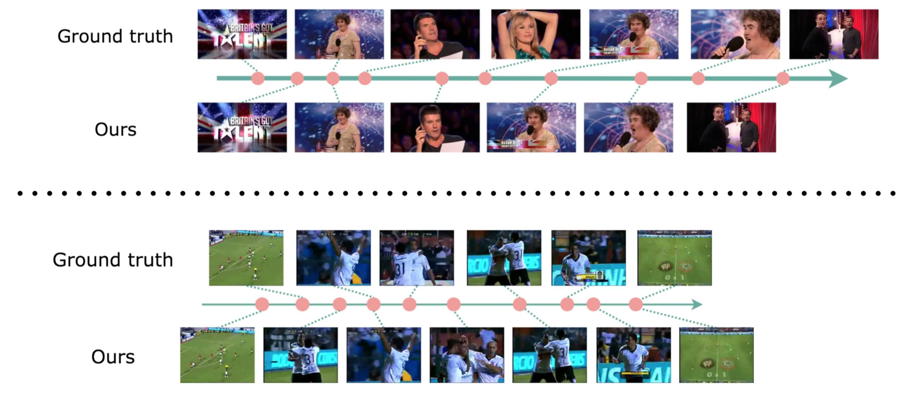

# [WACV'19] Attentive and Adversarial Learning for Video Summarization
A PyTorch implementation of VSumPtrGAN

[Project](https://tsujuifu.github.io/projs/wacv19_vsum-ptr-gan.html) | [Paper](https://tsujuifu.github.io/pubs/wacv19_vsum-ptr-gan.pdf) | [Youtube](https://youtu.be/0irqOrpAYgw)



## Overview

## Requirements

## Usage

## Resources

## Citation
```
@inproceedings{fu2019vsum-ptr-gan, 
  author = {Tsu-Jui Fu and Shao-Heng Tai and Hwann-Tzong Chen}, 
  title = {Attentive and Adversarial Learning for Video Summarization}, 
  booktitle = {IEEE Winter Conference on Applications of Computer Vision (WACV)}, 
  year = {2019} 
}
```

## Acknowledgement
