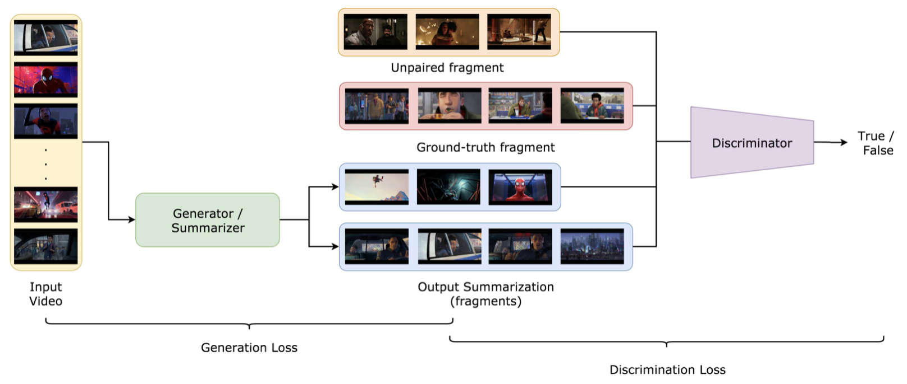
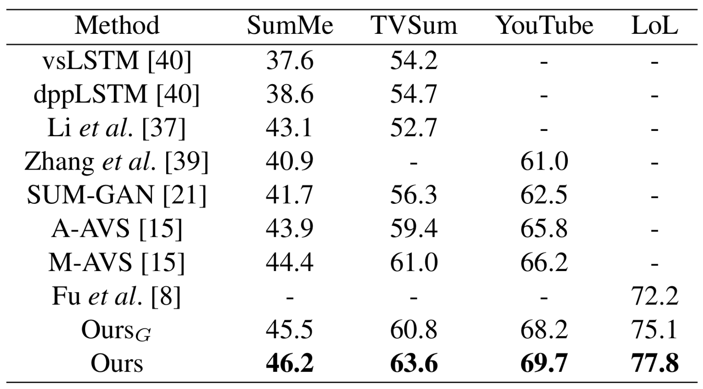

# [WACV'19 (oral)] Attentive and Adversarial Learning for Video Summarization
A **PyTorch** implementation of VSumPtrGAN

[Paper](https://tsujuifu.github.io/pubs/wacv19_vsum-ptr-gan.pdf) | [Video](https://youtu.be/0irqOrpAYgw)


## Overview
VSumPtrGAN is an implementation of <br>
"[Attentive and Adversarial Learning for Video Summarization](https://tsujuifu.github.io/pubs/wacv19_vsum-ptr-gan.pdf)" <br>
[Tsu-Jui Fu](https://tsujuifu.github.io/), Shao-Heng Tai, and [Hwann-Tzong Chen](http://www.cs.nthu.edu.tw/~htchen/) <br>
in IEEE Winter Conference on Applications of Computer Vision (**WACV**) 2019 (oral)



VSumPtrGAN a GAN-based training framework, which combines the merits of unsupervised and supervised video summarization approaches. The **generator is an attention-aware Ptr-Net** that generates the cutting points of summarization fragments. The **discriminator is a 3D CNN classifier** to judge whether a fragment is from a ground-truth or a generated summarization. Our Ptr-Net generator can **overcome the unbalanced training-test length** in the seq2seq problem, and our discriminator is effective in **leveraging unpaired summarizations** to achieve better performance.



## Requirements
This code is implemented under **Python3** and [PyTorch](https://pytorch.org). <br>
Following libraries are also required:
+ [PyTorch](https://pytorch.org) >= 0.4
+ [FFmpeg](https://www.ffmpeg.org)

## Usage
+ VisualExtractor
```
Dataset/model_visual-extractor.ipynb
```

+ VSumPtrGAN
```
model_vsum-ptr-gan.ipynb
```

## Resources
+ [SumMe Dataset](https://gyglim.github.io/me/vsum/index.html)
+ [TVSum Dataset](https://webscope.sandbox.yahoo.com/catalog.php?datatype=i&did=72)
+ [YouTube Dataset](https://sites.google.com/site/vsummsite/download) ([Preprocessed](https://drive.google.com/drive/folders/1LXMVZyLjFNkotTmboukQU8iIHoeKyDA-?usp=sharing))
+ [LoL Dataset](https://github.com/chengyangfu/Pytorch-Twitch-LOL)

## Citation
```
@inproceedings{fu2019vsum-ptr-gan, 
  author = {Tsu-Jui Fu and Shao-Heng Tai and Hwann-Tzong Chen}, 
  title = {Attentive and Adversarial Learning for Video Summarization}, 
  booktitle = {IEEE Winter Conference on Applications of Computer Vision (WACV)}, 
  year = {2019} 
}
```

## Acknowledgement
+ [Umbo Computer Vision](https://umbocv.ai)
+ [pytorch_seq-gan](https://github.com/suragnair/seqGAN)
